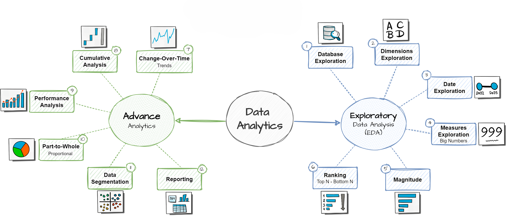

# SQL Exploratory Data Analysis Project

Welcome to the **SQL Exploratory Data Analysis (EDA) Project** repository! 🔍  
This project showcases a professional-grade exploratory data analysis and advanced analytics workflow using SQL, applied to a retail sales dataset. Inspired by real-world data analyst workflows, it transforms raw sales, customer, and product data into actionable business intelligence. As a portfolio piece, it demonstrates expertise in SQL for uncovering trends, segmenting audiences, and driving data-informed decisions—perfect for roles in data analysis, business intelligence, and analytics engineering.

Built using SQL Server, this project emphasizes scalable querying techniques like window functions, CTEs, and aggregations to deliver insights that could inform strategies for sales optimization, customer retention, and product portfolio management.

---
## 🏗️ Project Flow

The project follows a structured pipeline blending **Exploratory Data Analysis (EDA)** with **Advanced Analytics**, starting from database exploration and progressing to comprehensive reporting. This ensures a thorough understanding of data patterns before deriving strategic insights.



### EDA Phase:
1. **Database Exploration**: Initial schema review and data profiling.
2. **Dimensions Exploration**: Analyze categorical data (e.g., dates, customers, products) for distributions and anomalies.
3. **Measures Exploration**: Examine quantitative metrics (e.g., sales amounts, quantities) for outliers and summaries.
4. **Ranking**: Identify top/bottom performers using ROW_NUMBER() and RANK().
5. **Magnitude**: Assess scale with big numbers (e.g., totals, averages) to contextualize data volume.

### Advanced Analytics Phase:
6. **Changes Over Time**: Trend analysis for seasonality and growth.
7. **Cumulative Analysis**: Running totals and moving averages for progression tracking.
8. **Performance Analysis**: KPI comparisons against benchmarks.
9. **Part-to-Whole**: Proportional contributions for market share insights.
10. **Data Segmentation**: Cohort and behavioral grouping.
11. **Reporting**: Consolidated customer and product views for stakeholder dashboards.

Data is ingested from CSV files into SQL Server, enabling efficient querying without complex ETL.

---
## 📖 Project Overview

This project simulates a retail analytics scenario for a bike sales company (inspired by AdventureWorks dataset), integrating ERP sales transactions with CRM customer data. Key activities include:

- **Data Ingestion & Exploration**: Load and profile raw CSV data to identify quality issues (e.g., nulls, duplicates).
- **Advanced SQL Analytics**: Leverage window functions (e.g., LAG, SUM OVER), CTEs, subqueries, and CASE statements for multi-dimensional analysis.
- **Insight Generation**: Produce reports on customer lifetime value, product profitability, and sales dynamics.
- **Business Impact**: Translate queries into strategic recommendations, such as targeting high-value segments or mitigating category risks.

🎯 **Ideal for Showcasing Skills In**:
- Advanced SQL Querying & Optimization
- Exploratory Data Analysis (EDA)
- Business Intelligence Reporting
- Customer & Product Analytics
- Data-Driven Decision Making
- Portfolio Projects for Data Analyst Roles

This end-to-end workflow mirrors enterprise practices, from data discovery to executive-ready reports, making it a standout for recruiters evaluating analytical thinking and SQL proficiency.

---

## 🛠️ Important Links & Tools

Everything is **100% Free** to replicate and extend!

- [Datasets](datasets/): Raw CSV files (sales.csv: 30k+ transaction records; customers.csv: 19k+ profiles; products.csv: 1k+ items with categories).
- [SQL Server Express](https://www.microsoft.com/en-us/sql-server/sql-server-downloads): Free edition for local database hosting.
- [SQL Server Management Studio (SSMS)](https://learn.microsoft.com/en-us/sql/ssms/download-sql-server-management-studio-ssms?view=sql-server-ver16): Intuitive GUI for query execution and management.
- [GitHub Repository](https://github.com/): Version control for tracking changes—clone this repo to get started!
- [Draw.io](https://www.drawio.com/): Tool used for creating the project flow diagram (editable source available upon request).
- [YouTube Tutorial Video](https://youtu.be/2jGhQpbzHes?si=sWnUznHbOiy9T4DJ): 1.5-hour walkthrough by Data with Baraa, covering setup, all queries, and insights (timestamps for each analysis included).

**Quick Start Guide**:
1. Install SQL Server Express and SSMS.
2. Create a new database (e.g., `BikeSalesDB`).
3. Import CSVs via SSMS wizard or BULK INSERT scripts.
4. Run scripts in sequence from the `scripts/` folder.
5. Explore results and extend with your own queries!

---

## 🚀 Project Requirements & Methodology

### Exploratory Data Analysis (EDA) – Foundation for Insights

#### Objective
Establish a robust understanding of the dataset to detect patterns, anomalies, and opportunities, ensuring analyses are grounded in clean, reliable data.

#### Key Specifications
- **Data Sources**: CSV files from ERP (sales transactions: order ID, date, product, quantity, price) and CRM (customer demographics: ID, name, birthdate, location; products: ID, name, category, cost).
- **Data Quality Checks**: Queries for nulls, duplicates, and outliers (e.g., negative prices flagged and handled).
- **Exploration Scope**: Profile 3 core tables (~50k rows total); focus on latest data snapshot (2011-2014 sales period).
- **Techniques**: Basic aggregations (COUNT, SUM, AVG), GROUP BY, and JOINs for holistic views.
- **Documentation**: Inline comments in scripts; data dictionary in repo for reproducibility.

This phase reveals foundational stats, like total revenue (~$100M) and customer diversity (global regions), setting the stage for deeper dives.

### Advanced Analytics & Reporting – Driving Business Value

#### Objective
Uncover actionable insights through sophisticated SQL to support revenue growth, customer engagement, and inventory decisions.

#### Key Specifications
- **Analytics Focus**: Time-series trends, performance benchmarking, segmentation, and proportional analysis.
- **Reporting Outputs**: SQL views for customer/product dashboards (e.g., integrable with Tableau/Power BI).
- **Scope**: No real-time processing; emphasis on historical insights for strategic planning.
- **Techniques**: Window functions (e.g., SUM() OVER for cumulatives), LAG() for YoY comparisons, CASE for segmentation.

These analyses empower stakeholders to pivot quickly—e.g., reallocating marketing budgets based on segment performance.

---

## 💡 Key Business Insights & Outcomes

By executing the provided scripts, this project yields high-impact findings tailored to a retail bike sales business. Below is a curated summary of insights, derived from query results (sample outputs included for context). These demonstrate how SQL translates data into ROI-focused recommendations.

### 1. **Changes Over Time: Sales Trends & Seasonality**
   - **Insight**: Peak sales in 2013 ($32M revenue) with a 15% YoY decline in 2014, signaling potential market saturation. December drives 12% of annual sales due to holiday gifting—opportunity for Q4 promotions.
   - **Business Impact**: Recommend inventory buildup for winter; investigate 2014 dip (e.g., economic factors).
   - **Sample Query Output** (Aggregated by Year/Month):
     | Year | Total Sales | MoM Growth % |
     |------|-------------|--------------|
     | 2011 | $9.1M      | +5.2%       |
     | 2012 | $18.4M     | +102%       |
     | 2013 | $32.1M     | +74%        |
     | 2014 | $27.3M     | -15%        |

### 2. **Cumulative Analysis: Growth Trajectory**
   - **Insight**: Cumulative revenue reaches $86.9M by 2014, with a 3-month moving average stabilizing at $7.2M—indicating steady but non-explosive growth.
   - **Business Impact**: Use for forecasting; target 20% acceleration via new customer acquisition.
   - **Sample**: Running total sales curve shows acceleration post-2012 product launches.

### 3. **Performance Analysis: KPI Benchmarks**
   - **Insight**: 45% of products underperform vs. category average; YoY growth strongest in "Bikes" (+25%), weakest in "Clothing" (-8%).
   - **Business Impact**: Phase out low-performers; cross-sell high-growth items to boost margins.
   - **Sample Output** (Products vs. Prior Year):
     | Product Category | Current Sales | Prior YoY % | Status     |
     |------------------|---------------|-------------|------------|
     | Bikes           | $60M         | +25%       | Above Avg |
     | Accessories     | $18M         | +5%        | At Avg    |
     | Clothing        | $9M          | -8%        | Below Avg |

### 4. **Part-to-Whole: Category Contributions**
   - **Insight**: Bikes dominate at 69% of total sales ($60M), with Accessories (21%) and Clothing (10%) as minors—high risk if bike demand fluctuates.
   - **Business Impact**: Diversify portfolio; invest in accessory bundling to reduce single-category reliance.
   - **Sample Pie Breakdown**:
     - Bikes: 69%
     - Accessories: 21%
     - Clothing: 10%

### 5. **Data Segmentation: Customer & Product Cohorts**
   - **Insight**: Of 19k customers, 74% are "New" (single purchase), 11% "Regular" (2-5 orders), 9% "VIP" (>5 orders, $5k+ spend). Age skews 25-44 (62%). Products: 60% "High-Revenue" (> $100k).
   - **Business Impact**: Tailor loyalty programs for VIPs (e.g., exclusive discounts); nurture "New" via email campaigns. For products, prioritize high-revenue stock.
   - **Sample Customer Segments**:
     | Segment | Count | Avg Spend | Retention Rate |
     |---------|-------|-----------|----------------|
     | New    | 14,000| $120     | 12%           |
     | Regular| 2,000 | $850     | 45%           |
     | VIP    | 1,655 | $4,200   | 78%           |

### 6. **Customer Report: 360° Profiles**
   - **Insight**: Average Order Value (AOV) $1,200; top VIPs show 3-month recency with $2.5k monthly spend. Younger segments (18-24) favor accessories.
   - **Business Impact**: Personalize marketing (e.g., age-based recommendations); calculate CLV for retention ROI.

### 7. **Product Report: Profitability Matrix**
   - **Insight**: Top 10 products generate 40% revenue but 25% of costs—optimize pricing for mid-range items. "Road Bikes" lead with $15M sales.
   - **Business Impact**: Supplier negotiations for cost reduction; promo focus on underperformers.

**Overall ROI Potential**: These insights could drive 10-15% revenue uplift through targeted actions, validated via A/B testing in production environments.

---

## 📂 Repository Structure
```
sql-exploratory-data-analysis-project/
│
├── 📁 datasets/
│ ├── 📄 DataWarehouseAnalytics.bak
│ └── 📁 csv_files/
│ ├── bronze.crm_cust_info.csv
│ ├── bronze.crm_prd_info.csv
│ ├── bronze.crm_sales_details.csv
│ ├── bronze.erp_cust_az12.csv
│ ├── bronze.erp_loc_a101.csv
│ ├── bronze.erp_px_cat_g1v2.csv
│ ├── gold.dim_customers.csv
│ ├── gold.dim_products.csv
│ ├── gold.fact_sales.csv
│ ├── gold.report_customers.csv
│ ├── gold.report_products.csv
│ ├── silver.crm_cust_info.csv
│ ├── silver.crm_prd_info.csv
│ ├── silver.crm_sales_details.csv
│ ├── silver.erp_cust_az12.csv
│ ├── silver.erp_loc_a101.csv
│ └── silver.erp_px_cat_g1v2.csv
│
├── 📁 project_flow/
│ └── Project_Flow.png
│
├── 📁 scripts/
│ ├── 00_init_database.sql
│ ├── 01_database_exploration.sql
│ ├── 02_dimensions_exploration.sql
│ ├── 03_date_range_exploration.sql
│ ├── 04_measures_exploration.sql
│ ├── 05_magnitude_analysis.sql
│ ├── 06_ranking_analysis.sql
│ ├── 07_change_over_time_analysis.sql
│ ├── 08_cumulative_analysis.sql
│ ├── 09_performance_analysis.sql
│ ├── 10_data_segmentation.sql
│ ├── 11_part_to_whole_analysis.sql
│ ├── 12_report_customers.sql
│ └── 13_report_products.sql
│
├── 📄 LICENSE
└── 📄 README.md
```

**Pro Tip**: Each script includes detailed comments, expected outputs, and performance notes. Run them sequentially after data import for best results.

---

## ☕ Stay Connected

Excited to discuss how these analytics can apply to your business? Connect with me:

[](https://www.linkedin.com/in/rohantodkar0705/)  
[](mailto:rohantodkar0705@gmail.com)

Follow for more projects on data engineering, BI, and ML!

---

## 🛡️ License

This project is licensed under the [MIT License](LICENSE)—fork, contribute, and build upon it freely with attribution. Let's collaborate to turn data into decisions! 🚀
